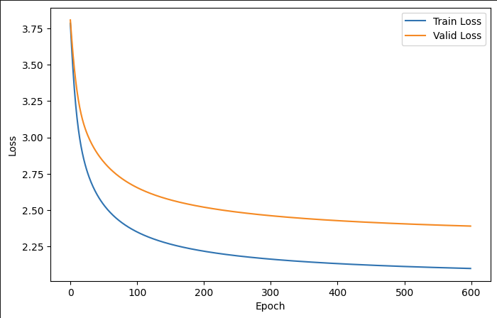

# 🤖 LLM-makemore-AK

## Project Overview

This repository contains my personal, from-scratch implementations of fundamental algorithms and architectures behind **autoregressive language models (LLMs)**. The core goal of this project is to gain a deep, intrinsic understanding of neural networks, deep learning mechanics, and natural language processing (NLP) by building these systems using core PyTorch tensors, avoiding high-level abstractions.

## Inspiration and Methodology

The primary inspiration for this project comes from the educational series **"Neural Networks: Zero to Hero"** by **Andrej Karpathy** (specifically the **"makemore"** modules).

* **Approach:** All code is written **independently** and focuses on replicating the core mathematical concepts and forward/backward passes shown in the course.
* **Added Value:** The notebooks include several custom experiments.


## 🔬 **Project Part Description**

| Part | File | Description |
| :--- | :--- | :--- |
| Part_1 | `Trigram_Neural_Net` | The statistical baseline and simple neural network model for next-character prediction.
| Part_2 | `MLP_Language_Model` | Building an MLP with an **Embedding Layer**.
| Part_2 | `MLP_Activations_Gradients_and_BatchNorm` | Explanation of Activation functions, gradients and Batch Normalization.

---

## Table of Contents
- [(Part 1) Trigram Neural Net](#trigram-neural-net)
  - [Part Overview](#part-1-overview)
  - [Model Architecture](#model-architecture)
  - [Data and Tokenization](#data-and-tokenization)
  - [Example Results](#example-results)
- [(Part 2) MLP Language Model](#mlp-language-model)
   - [Part Overview](#mlp-part-2-overview)
   - [What is an Embedding Layer](#what-is-an-embedding-layer)
   - [Model Architecture](#mlp-model-architecture)
   - [MLP Training and Evaluation](#mlp-training-and-evaluation)
   - [MLP Example Results](#mlp-example-results)
   - [Model Initialization and Loss Baseline](#model-initialization-and-loss-baseline)
- [(Part 3) MLP Activations, Gradients and BatchNorm](#mlp-activations-gradients-and-batchnorm)
   - [Part Overview](#mlp-part-3-overview)
   - [Key Takeaways](#mlp-part-3-key-takeaways)
   - [Key Topics Explored](#mlp-part-3-topics-explored)

---

## 🧠Trigram Neural Net

### 📜Part 1 Overview

This section covers the implementation of a basic neural network model designed to predict the third character in a sequence based on the preceding two characters (a **Trigram** context). This project directly addresses a core challenge in Language Modeling: moving from **count-based n-gram models** to **dense, parameter-based neural network models**.

The goal was to conceptually transition from the traditional count-based Trigram probability matrix (represented by the `N` tensor in the code) to a simple, fully connected layer (represented by the weight matrix **W**).

By using a **linear model** with a **one-hot encoded input** instead of a traditional lookup table, the model effectively learns the log-counts/logits directly in its weight parameters.

The final output of this model is a probability distribution over the entire vocabulary, enabling the generation of new sequences (names).

#### Key Learning Objectives:

* **Tokenization:** Handling character-level tokenization and creating the vocabulary/mapping (`character to integer`, `integer to character`).
* **Trigram Counts:** Building and visualizing the foundational count-based probability distribution.
* **Neural Network as a Lookup:** Implementing a network where the input is a **one-hot encoded context** and the weight matrix `W` directly serves as the learned "lookup table" for log-counts/logits.
* **Training Loop:** Utilizing PyTorch for the forward pass, calculating Cross-Entropy Loss (Negative Log Likelihood), and performing weight updates via gradient descent.

---

### 🔢Model Architecture

The model is an extremely simple, single-layer neural network that serves a replacement for the traditional count-based Trigram matrix.

#### 1. Input Context (X)

* **Size:** The input consists of 702 classes.
* **Encoding:** Each valid two-character context ($C_1C_2$) is converted into a **one-hot encoded vector** of size 702.
> Note: An alternative approach would be to use separate embedding layers for $C_1$ and $C_2$, concatenate their vectors, and feed them into a hidden layer.
However, this implementation uses a single one-hot vector for the combined context $C_1C_2$.
This design ensures that the model **retains positional information**—a context like 'az' is fundamentally different from 'za' and is assigned a unique input index.
Using two separate, concatenated one-hot vectors for $C_1$ and $C_2$ (each of size 27) would result in a combined vector of size 54,
but the simple dot product with the weight matrix $W$ would lose the critical positional distinction needed for a direct lookup.

#### 2. The Weight Matrix (W)

The core of the model is a single weight matrix $W$.
* **Dimensions:** $W$ has a shape of **(702, 27)**.
    * **702** rows correspond to the valid input contexts ($C_1C_2$).
    * **27** columns correspond to the output vocabulary (the potential next character $C_3$).

#### 3. Output and Loss Function

* **Forward Pass:**
    1.  **Logits:** $L = X_{\text{enc}} \cdot W$
    2.  **Probabilities:** The logits $L$ are passed through the **Softmax** function to convert them into a probability distribution $\hat{P}$ over the 27 possible next characters.
* **Loss Function:** The network is trained using the **Cross-Entropy Loss**, which is equivalent to the **Negative Log Likelihood (NLL)**.
    $\text{Loss} = \text{NLL} + \lambda \sum W^2$
    * A weight decay term ($\lambda = 0.001$) is added to the loss as a simple form of regularization to prevent overfitting.

---
 
### 💾Data and Tokenization

#### Data Source
The model was trained on a dataset of approximately **32k** English names, sourced from `names.txt`.

#### Character-Level Tokenization
The project uses **character-level tokenization**.
* **Vocabulary Size (V):** 27 unique tokens (26 English letters + the special token `.` representing the start or end of a name).
* **Mapping:** Dictionaries `ch2i` and `i2ch` are used to map characters to integers and vice versa.

#### Trigram Context Preparation

The input $X$ for the model is a two-character context ($C_1, C_2$), and the label $Y$ is the next character ($C_3$).

#### Context Reduction (Filtering Impossible Sequences)
In a character-level trigram model using `.` for start/end, any context where the second character $C_2$ is the end token (`.`) is impossible. Since we use `.char` and `char.` as valid boundaries, sequences like `a.` or `m.` (where `.` is $C_2$) should never occur.

To optimize the model input, the original $V \times V = 729$ possible contexts were filtered. All $27$ contexts of the form `$C_1$.` were removed, resulting in a total of **702 valid context sequences** used for training.

---

### ✨Example Results

After training the model for **600** iterations, the network successfully learned the statistical patterns and common trigrams present in the input dataset. 
Below is a chart describing the training and validation losses:


Following the initial training, the model went through a final **tuning phase** where the **Training** and **Validation** datasets were concatenated (`X_conc_enc, y_conc`). 
The model was trained for an additional **200** iterations on this combined dataset to maximize parameter optimization.
  
The final **Test Loss (NLL)** achieved was approximately **2.35**.

Below are 10 examples of names generated by sampling from the final probability distribution $\hat{P}$ (the weights `W`) of the model:
```text
.akhir.
.vanshri.
.na.
.vallee.
.kayceoran.
.anvea.
.wila.
.emriya.
.kai.
.deeigh.
```

---

## 🧠MLP Language Model

### 📜MLP Part 2 Overview

This part transitions from the simple linear model (Part 1) to a modern **Multi-Layer Perceptron (MLP)** architecture. The core innovation here is the introduction of **Embedding Layers** to manage the input context and the use of **non-linear activation functions** (like $\tanh$) in hidden layers.

This architecture aims to solve the limitations of the previous model, which relied on inefficient one-hot encoding of the entire context ($C_1C_2$). By using dense embeddings, the model can now:

1.  **Generalize Relationships:** Learn subtle, distributed relationships between characters that go beyond simple count-based.
2.  **Overcome Curse of Dimensionality:** Drastically reduce the input size complexity by mapping sparse one-hot vectors into a low-dimensional, dense space.

The resulting deep model is significantly more powerful, capable of capturing complex linguistic patterns and achieving a lower loss on the validation dataset.

---

### 💡What is an Embedding Layer

An **Embedding Layer** is essentially a **lookup table** (a weight matrix ***C***). It maps discrete, high-dimensional tokens (such as a character represented by a single integer ID) into a continuous, low-dimensional vector space.

Instead of representing a character by a sparse one-hot vector (e.g., [0, 0, 1, 0...]), the embedding layer transforms it into a dense vector of floating-point numbers (e.g., [-0.5, 1.2, 0.8]). This process allows the model to learn a meaningful **feature representation** for each token, where tokens with similar semantic or statistical roles are positioned closer together in the vector space.

---

#### Key Learning Objectives:

* **Embedding Layer:** Implementation of a lookup table (`C`) to map discrete tokens (characters) to continuous, dense feature vectors.
* **Context Vectorization:** Transformation of the input context sequence (e.g., [1, 5, 2]) into a single, flattened feature vector.
* **Non-Linearity:** Introduction of the $\tanh$ activation function to enable the model to learn complex, non-linear mappings.
* **Training Techniques:** Implementing learning rate scheduling and data splitting for validation and testing.

---

### 🔢MLP Model Architecture

This implementation utilizes a **three-layer Multi-Layer Perceptron (MLP)**. The model takes a sequence of three characters as context ($C_1C_2C_3$) and processes them through an embedding layer and two non-linear hidden layers before generating the final prediction.

#### 1. Input and Embedding Layer (***C***)

* **Context Size:** $T = 3$ (three preceding characters).
* **Embedding Dimension:** $D_{\text{emb}} = 10$.
* **Embedding Matrix ($\mathbf{C}$):** $\mathbf{C}$ has the shape $(\text{Vocabulary Size}, D_{\text{emb}})$, i.e., **(27, 10)**.
* **Forward Pass:** Each character in the context is mapped to its dense vector representation. The three resulting vectors are **concatenated** to form a single input vector $\mathbf{X}_{\text{flat}}$.
    * $\mathbf{X}_{\text{flat}}$ dimension: $T \times D_{\text{emb}} = 3 \times 10 = **30**$.
    

#### 2. Hidden Layers

The model employs two hidden layers, both using the **hyperbolic tangent ($\tanh$)** activation function to introduce non-linearity.

| Layer | Weights | Bias | Input Dim | Output Dim | Activation |
| :--- | :--- | :--- | :--- | :--- | :--- |
| **Hidden Layer 1 ($\mathbf{H}1$)** | $\mathbf{W}1$ | $\mathbf{b}1$ | 30 | 200 | $\tanh$ |
| **Hidden Layer 2 ($\mathbf{H}2$)** | $\mathbf{W}2$ | $\mathbf{b}2$ | 200 | 100 | $\tanh$ |

**Mathematical Operation:**
$$\mathbf{H}1 = \tanh(\mathbf{X}_{\text{flat}} \cdot \mathbf{W}1 + \mathbf{b}1)$$
$$\mathbf{H}2 = \tanh(\mathbf{H}1 \cdot \mathbf{W}2 + \mathbf{b}2)$$

#### 3. Output Layer

* **Weights ($\mathbf{W}3$):** $\mathbf{W}3$ has the shape **(100, 27)**.
* **Bias ($\mathbf{b}3$):** $\mathbf{b}3$ has the shape **(27)**.
* **Logits:** The final layer calculates the logits (unnormalized log-probabilities) for the next character.
    $$\text{Logits} = \mathbf{H}2 \cdot \mathbf{W}3 + \mathbf{b}3$$
* **Loss Function:** The **Cross-Entropy Loss** (equivalent to Negative Log Likelihood) is used for training.

$$\text{Loss} = \text{CrossEntropy}(\text{Logits}, Y_{\text{true}})$$

---

### MLP Training and Evaluation

#### 1. Data Split Strategy

To ensure robust evaluation and prevent overfitting, the dataset was split into three distinct subsets:

| Dataset | Split Percentage | Purpose |
| :--- | :--- | :--- |
| **Training Set** | 80% | Used for primary optimization and weight updates. |
| **Validation Set** | 10% | Used for hyperparameter tuning and early stopping detection. Loss on this set ($L_{\text{valid}}$) is the key metric for model quality. |
| **Test Set** | 10% | Used only **once** at the very end to provide a final, unbiased measure of model performance. |

#### 2. Learning Rate Scheduling

A dynamic learning rate (LR) schedule was implemented to facilitate faster convergence in the initial phase and stable optimization later on:

* **Initial Phase (Steps 0 - 100,000):** $LR = 0.1$
* **Mid Phase (Steps 100,001 - 200,000):** $LR = 0.01$ (Reduced by a factor of 10)
* **Final Phase (Steps 200,001 - 300,000):** $LR = 0.005$ (Reduced by a factor of 2 from the Mid Phase)

This **step decay** approach ensures the model can escape early local minima while stabilizing the parameters as it approaches the global optimum. 

#### 3. Model Tuning and Final Loss

* **Primary Training:** The model was trained for **300,000** steps on the Training Set. Below is the training result.  

* **Validation Loss:** The loss achieved on the Validation Set was **2.0454**.
* **Final Tuning:** After the primary training, the Training and Validation datasets were **concatenated** (`X_conc`, `y_conc`). The model was trained for an additional **100,000** steps on this combined dataset using a final, lower LR ($0.001$) to maximize the utilization of all available data.
* **Test Loss:** The final, reported performance on the unseen Test Set was **2.0415**.

---

### ✨MLP Example Results

#### Model Inference (Generation)

Once the model is trained, it can be used to generate new sequences (names):

1.  **Start:** The sequence is initialized with the special start token (`.`).
2.  **Forward Pass:** The current context (e.g., `['.', 'a', 'b']`) is passed through the MLP to obtain the output logits.
3.  **Softmax & Sampling:** The logits are converted into a probability distribution $\hat{P}$ using **Softmax**. The next character is selected using **multinomial sampling** from $\hat{P}$, which introduces randomness consistent with the model's learned probabilities.
4.  **Loop:** The newly sampled character is added to the sequence, the context window shifts, and the loop continues until the end token (`.`) is sampled.

#### Generated Examples (20 Names)
```text
.erynn.
.travayiden.
.iloysta.
.branyaelynn.
.mely.
.wese.
.geina.
.lylah.
.xafylen.
.vin.
.phy.
.wylle.
.gezteh.
.kealarkuoah.
.aresl.
.yar.
.sith.
.aunio.
.olyn.
.xye.
```

---

### 💡Model Initialization and Loss Baseline

#### 1. Theoretical Uniform Loss

The Cross-Entropy Loss (or Negative Log Likelihood) serves as the primary metric for evaluating the model. It is essential to understand the **theoretical baseline** for this loss.

If the model predicts probabilities that are **perfectly uniform** across all possible next tokens (i.e., every output token has an equal chance of being selected), the theoretical loss can be calculated as follows:

* **Vocabulary Size ($V$):** 27 (26 characters + 1 special token '.')
* **Uniform Probability ($P$):** $1/V = 1/27$
* **Cross-Entropy Loss (NLL):** $L = -\ln(P)$

$$L_{\text{uniform}} = -\ln\left(\frac{1}{27}\right) \approx 3.2958$$

This value, $\mathbf{3.2958}$, represents the *maximum expected starting loss* and serves as the goal for a *well-initialized* network before any learning takes place.

#### 2. Comparison of Initialization Strategies

| Strategy | Initialization | Starting Loss (Approx.) | Why the Difference? |
| :--- | :--- | :--- | :--- |
| **Original (Naive)** | `torch.randn` (default) | **$\sim 20$ to $\sim 30$** | **Large Logits:** Random weights with high variance lead to **very large** logit values. Softmax with large logits produces near-zero probabilities for most classes, resulting in extremely high loss. |
| **Tuned (Corrected)** | Weights: `torch.randn(...) * 0.01` <br> Biases: `torch.zeros(...)` | **$\sim 3.3$** | **Near-Zero Logits:** Small weights and zero biases ensure that logits are close to zero. $\text{Softmax}(\text{Logits} \approx 0)$ yields a near-uniform distribution ($\approx 1/27$), bringing the loss close to the theoretical baseline of $3.2958$. |

#### 3. The Problem with Naive Initialization

When initial weights are sampled directly from `torch.randn` (Gaussian distribution with standard deviation $\sigma=1$) and biases are non-zero:

1.  **Exploding Logits:** The multiplication of large random weights with the embedded inputs results in output logits (before Softmax) with **high magnitude**.
2.  **Softmax Saturation:** Softmax ($\text{Softmax}(x) = e^x / \sum e^x$) translates these large logits into probabilities that are **extremely close to 0 or 1** (i.e., the output distribution is sharply peaked). 
3.  **High NLL Loss:** If Softmax predicts a probability $\mathbf{P_{\text{pred}}}$ that is **near zero** for the **correct class** ($Y_{\text{true}}$), the loss becomes astronomically high, as $L = -\ln(P_{\text{pred}})$. For example, if $P_{\text{pred}} = 10^{-10}$, the resulting $-\ln(P_{\text{pred}}) \approx 23$.

The tuned initialization strategy (small weights and zero biases) ensures logits start near zero, guaranteeing that Softmax produces a nearly uniform distribution, and thus, an initial loss close to the ideal $3.2958$.

---

## 🧠(Part 3) MLP Activations, Gradients and Batch Normalization

### 📜MLP Part 3 Overview

This part focuses on a deeper, more **theoretical analysis** of neural network training dynamics.  
Rather than introducing a fundamentally new architecture, the goal here is to **understand why neural networks train well (or fail to train)** by inspecting:

- activation distributions,
- gradient flow during backpropagation,
- and the effect of normalization techniques.

This section closely follows the *“Activations, Gradients, and Batch Normalization”* lecture from **Andrej Karpathy’s “Neural Networks: Zero to Hero”** series.

---

### 🔍MLP Part 3 Key Topics Explored

* **Activation Distributions**
  - Analysis of hidden layer activations after $\tanh$
  - Identification of saturation at values close to **-1 and 1**
  - Explanation of vanishing gradients caused by saturated activations

* **Gradient Flow**
  - Inspection of gradient magnitudes across layers
  - Understanding how poor initialization can lead to dead or slow-learning neurons

* **Weight Initialization**
  - Motivation for scaling initial weights
  - Discussion of variance growth through linear layers
  - Introduction to **Kaiming (He) initialization** and its underlying intuition

* **Batch Normalization**
  - Normalization of pre-activations to zero mean and unit variance
  - Learnable scale (`gamma`) and shift (`beta`)
  - Stabilization of activation and gradient distributions during training

---

### ✅MLP Part 3 Key Takeaways

* Naive random initialization leads to:
  - highly saturated activations,
  - near-zero gradients,
  - unstable or slow training.
* Proper scaling of weights and the use of **Batch Normalization**:
  - keep activations in a healthy range,
  - preserve gradient flow,
  - and significantly improve optimization dynamics.
* While manual initialization strategies work well for shallow networks,
  modern deep models rely on principled initialization (e.g. Kaiming) and normalization layers.
